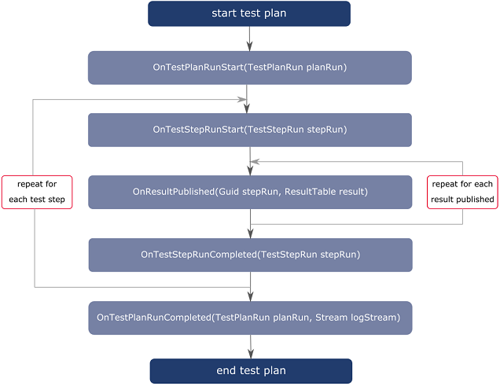

Result Listener
===============
OpenTAP comes with a number of predefined result listeners, summarized in the following table.

| **Group** | **Name** | **Description** |
| ----  | ---- |-------- |
| **Action**     | **Notifier**  |Runs a program or plays a sound based on the verdict of a test plan start and end.   |
| **Database**   | **PostgreSQL**  | Stores results into a PostgreSQL database.  |
|    **Database**            | **SqLite**   | Stores results into an SqLite database.  |
| **Text**       | **CSV**   | Stores results into a CSV file. Supported delimiters are semicolon (to avoid conflicts with commas in VISA addresses), comma and tab.|
|  **Text**              | **Log**   | Stores log messages (NOT results) into a log file. One file is created for each test plan run. |

OpenTAP also supports custom results listeners.

## Custom Result Listeners

A custom result listener stores the data in a "custom" way. For example, if OpenTAP is to be deployed in a manufacturing shop that has a preexisting data storage system, you can create a custom result listener to interface with that system.

To create a custom result listener, make a new public class which extends the OpenTAP.ResultListener class. The ResultListener class has virtual methods that are called during test plan execution. Implement only those that are needed for the specific ResultListener implementation. The SDK includes an ExampleResultListener that places a summary of any ResultTables into the log. 

For examples, see:

-	`TAP_PATH\Packages\SDK\Examples\PluginDevelopment\ResultListeners`

When extending the ResultListener class, the following methods can be overwritten:

-	`public override void OnTestPlanRunStart(TestPlanRun planRun)`
-	`public override void OnTestStepRunStart(TestStepRun stepRun)`
-	`public override void OnResultPublished(Guid stepRun, ResultTable result)`
-	`public override void OnTestStepRunCompleted(TestStepRun stepRun)`
-	`public override void OnTestPlanRunCompleted(TestPlanRun planRun, Stream logStream)`

These methods are called by OpenTAP and are guaranteed to be called in a certain order:

1. **OnTestPlanRunStart** - Called when the test plan starts and all resources have been opened (including Result Listeners). It takes a TestPlanRun argument, containing parameters for the plan run. 
2. **OnTestStepRunStart** - Called for each step when the step execution starts.
3. **OnResultPublished** - Called for each published result from the test step. This method is not called at all for test steps which do not publish any results.  
4. **OnTestStepRunCompleted** - Called for each step when the step execution stops. At this point it is guaranteed that the test step does not publish more results.
5. **OnTestPlanRunCompleted** - Called when the test plan run finishes. This is called once during a test plan execution. The TestPlanRun object contains information regarding the run, including the duration and final verdict. The LogStream contains the log file produced by the plan run. 

To illustrate the sequence of the above-mentioned methods, consider the following figure:

Note that if a step publishes multiple results the OnResultPublished method is called multiple times after the OnTestStepRunStart method. If there are multiple test steps the OnTestStepRunStart and OnTestStepRunCompleted methods are called as many times as the number of test steps.

The five methods described here run on a separate thread, and do NOT run synchronously with the test plan. That is important because the design of this class is to handle results, but NOT specifically to use the above methods to control external operations. The non-synchronous behavior was designed to allow faster throughput.

It is possible to abort the test plan execution in case the result listener fails or encounters an error.  This is done by calling the `PlanRun.MainThread.Abort()` method.

## OpenTAP SQL Database
Interacting with the predefined databases or interfacing to an unsupported database requires DB knowledge. 

When the user runs a test plan for the first time, the entire test plan file (XML) is automatically compressed and saved together with the test plan name in the Attachment database table, seen in the figure below. At the same time, the given test plan run is registered in the TestRun table, with time of execution and a reference to the test plan saved in the Attachment table. The log file of the test plan run is stored in the same table.

The TestRun table gets a new entry for each executed step in the test plan. The PlanRunID table points at the TestRun entry of the test plan run. The ParentRunID points to the entry of the parent step's run (if there is any). Associated with each TestRun, you can store multiple result series in the ResultSeries table. This points to the ResultType table, which contains additional information about the result data such as titles for the data columns/axis (x,y,z). The TestRun table points via the TestRun2Params to a range of different parameters in the Params table. These parameters become the public properties of the test step when the result series are generated.

Lastly, ResultSeries is pointed to by the Results table, so that each row in ResultSeries can have many results belonging to it.

The OpenTAP database schema consists of 11 tables, shown in the following diagram. You should explore the schema of the sample databases before attempting to write a new result listener targeting a new database.

